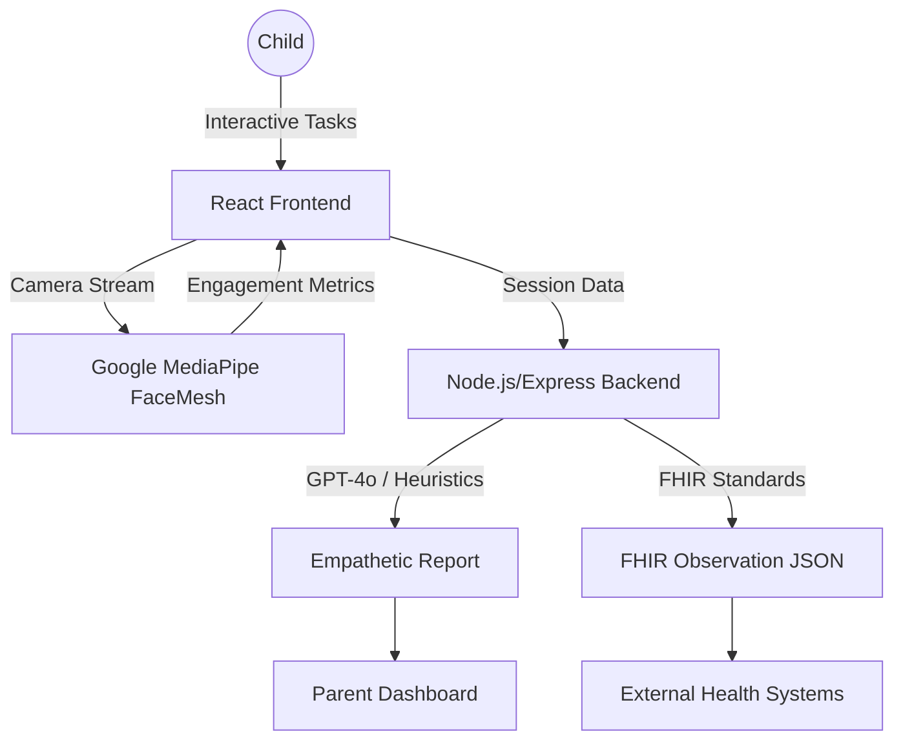

<p align="center">
  
</p>

# MindLoom: AI-Enabled Early Support for ASD

[](https://reactjs.org/)
[](https://www.typescriptlang.org/)
[](https://tailwindcss.com/)
[](https://nodejs.org/)
[](https://developers.google.com/mediapipe)

> **MindLoom** is a privacy-first, AI-driven platform designed to provide early support for identifying potential characteristics of Autism Spectrum Disorder (ASD) in children through interactive activities and behavioral analysis.

---

## ⚠️ Disclaimer
**This is a support tool and hackathon MVP, not a medical device. It does not provide medical diagnoses. Please consult a qualified healthcare professional for medical advice.**

---

## ✨ Key Features

- 👤 **Privacy-First Face Tracking**: Utilizes on-device **Google MediaPipe FaceMesh** to track engagement metrics (eye contact, gaze stability) without recording or transmitting video data.
- 🎮 **Interactive Child Flow**: Engaging activities including Emotion Recognition and Behavioral prompts, featuring high-contrast UI and responsive animations.
- 📊 **AI-Assisted Insights**: Generates empathetic parent reports using GPT-4o-mini (via OpenAI API) to interpret engagement metrics.
- 🏥 **FHIR Integration**: Export session results to FHIR-compliant Observation JSON objects, ensuring interoperability with modern healthcare systems.
- ⚡ **Demo Mode**: Instant access to end-state dashboards for rapid review and stakeholder presentation.

---

## 🏗️ Architecture



---

## 📂 Repository Structure

The repository is structured as a clean, production-ready workspace:

- **[frontend/](file:///Users/adityabatwal/Desktop/Computer%20Science/MindLoom/frontend)**: Client-side React (Vite) + TypeScript application. Features Google MediaPipe FaceMesh for local eye tracking, custom activities, and parent dashboard.
- **[backend/](file:///Users/adityabatwal/Desktop/Computer%20Science/MindLoom/backend)**: Server-side Node.js + Express + TypeScript app. Implements metric scoring heuristics and triggers empathetic report generation using the OpenAI API.
- **[api/](file:///Users/adityabatwal/Desktop/Computer%20Science/MindLoom/api)**: Serverless endpoint delegating requests to the Express server for Vercel deployment.
- **[vercel.json](file:///Users/adityabatwal/Desktop/Computer%20Science/MindLoom/vercel.json)**: Global configuration routing frontend and backend services on Vercel.

---

## 🛠️ Tech Stack

- **Frontend**: React (Vite), TypeScript, Tailwind CSS, Framer Motion, Lucide React
- **Backend**: Node.js, Express, TypeScript
- **AI/ML**: Google MediaPipe FaceLandmarker
- **API Integration**: OpenAI API (for report generation)

---

## 🚀 Getting Started

### Prerequisites
- Node.js (v18+)
- npm or yarn
- A modern web browser with camera access

### 1. Installation
Clone the repository and install dependencies in both frontend and backend directories:

```bash
# Clone the repository
git clone https://github.com/adibatwal7/mindloom.git
cd mindloom

# Install Frontend Dependencies
cd frontend
npm install

# Install Backend Dependencies
cd ../backend
npm install
```

### 2. Configuration
To enable AI-generated reports, add your OpenAI API key to the backend `.env` file:

1. Create/Open `backend/.env`
2. Add your key: `CLAUDE_API_KEY=your_openai_api_key_here`
   *(Note: The environment variable name remains `CLAUDE_API_KEY` for legacy compatibility, but the backend now uses OpenAI's GPT-4o-mini).*

### 3. Running Locally
Start both the frontend and backend development servers:

```bash
# Terminal 1: Frontend
cd frontend
npm run dev

# Terminal 2: Backend
cd backend
npm run dev
```

Navigate to `http://localhost:5173` to start using MindLoom.

---

## 📋 Limitations (Hackathon Scope)

- **Heuristic-Based Analysis**: Engagement scores are currently calculated using naive proxies (presence and stability) rather than clinical psychological models.
- **Stateless Backend**: Session data is handled in-memory or exported, with no persistent database integration for this MVP.
- **Device Support**: Optimized for desktop browsers with integrated webcams; mobile responsiveness is in early beta.

---

## 🗺️ Roadmap

- [ ] Persistent Database Integration (Supabase/PostgreSQL)
- [ ] Longitudinal Tracking across multiple sessions
- [ ] Integration with more clinical screening frameworks (M-CHAT, etc.)
- [ ] Multi-Modal Analysis (Audio/Prosody detection)

---

## 📄 License
Distributed under the MIT License. See `LICENSE` for more information.

---

<p align="center">
  Built with ❤️ for better early childhood support.
</p>
